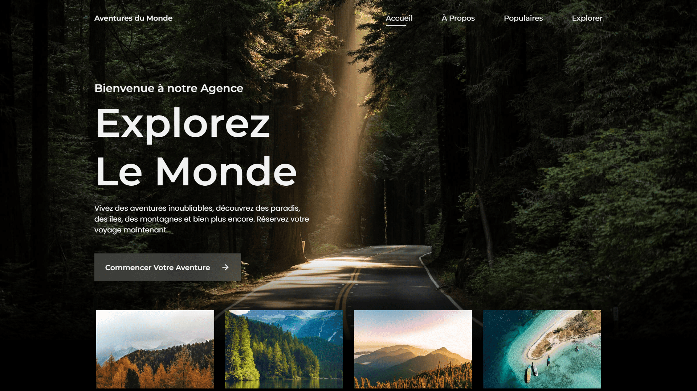

<div align="center">  
    <a href="https://travel-agency-2-vm.netlify.app/" target="_blank">  
        
    </a>
    </br>  
    </br>  
  <h3 align="center">🌍 Aventures du Monde &nbsp; — &nbsp; Agence de Voyage</h3>  
</div>

## <br /> 📌 Sommaire

&nbsp;&nbsp;&nbsp; 🎨 &nbsp; [**Introduction**](#introduction)<br />
&nbsp;&nbsp;&nbsp; 🛠️ &nbsp; [**Technologies**](#technologies)<br />
&nbsp;&nbsp;&nbsp; 🎯 &nbsp; [**Fonctionnalités**](#fonctionnalités)<br />
&nbsp;&nbsp;&nbsp; 🚀 &nbsp; [**Installation**](#installation)<br />

## <br /> <a name="introduction">🎨 Introduction</a>

Aventures du Monde est une **landing page** moderne et immersive pour une agence de voyage. Le site présente des destinations populaires à travers un design sombre, responsive, avec animations **ScrollReveal**, menu burger, formulaire d'inscription et effet de flou sur le header.

## <br /> <a name="technologies">🛠️ Technologies</a>

- HTML5 sémantique et structuration claire
- CSS3 moderne avec variables, media queries et animations
- JavaScript ES6 clair et modulaire
- [ScrollReveal](https://scrollrevealjs.org/) pour des animations au scroll
- [Remix Icons](https://remixicon.com/) pour des icônes vectorielles modernes
- Responsive Design pensé en mobile-first

## <br /> <a name="fonctionnalités">🎯 Fonctionnalités</a>

- Menu burger mobile avec liens actifs dynamiques
- Effet de flou sur le header au scroll
- Section d'accueil avec image pleine largeur et cards animées
- Bloc À propos avec image et bouton découverte
- Section destinations populaires en grilles
- Bloc Explorer avec image fixe et témoignage utilisateur
- Formulaire d'abonnement à la newsletter
- Footer complet avec 4 colonnes et réseaux sociaux
- Bouton scroll-up dynamique
- Responsive design pour tous écrans

## <br /> <a name="installation">🚀 Installation</a>

### ✅ Prérequis

- [Google Chrome](https://www.google.com/) &nbsp;—&nbsp; Navigateur moderne
- [Visual Studio Code](https://code.visualstudio.com/) &nbsp;—&nbsp; Éditeur de code
- [Live Server](https://marketplace.visualstudio.com/items?itemName=ritwickdey.LiveServer) &nbsp;—&nbsp; Extension VS Code

### 📥 Cloner le projet

```bash
git clone git@github.com:ValentinMadiot/travel-agency-2_ui
cd travel-agency-2_ui
```

### ▶️ Lancer le projet

Il suffit d’ouvrir le fichier `index.html` dans un navigateur, ou d’utiliser l’extension **Live Server** sur VS Code pour un aperçu dynamique.
